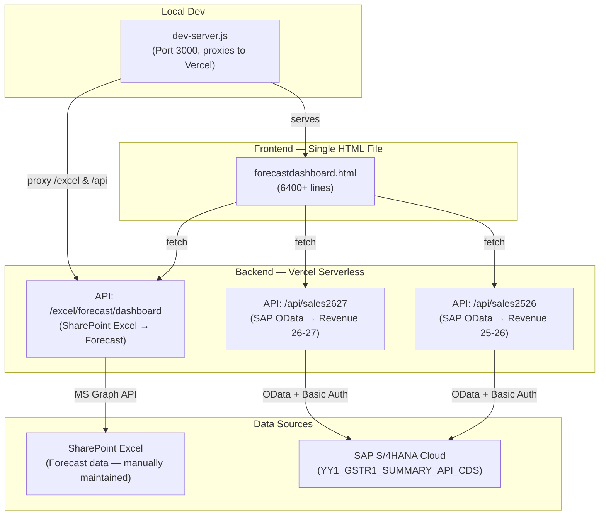

# YD Projects — Sales & Cash Flow Dashboard
## Full Project Context & Architecture

---

## 1. What Is This Project?

This is an **internal enterprise dashboard** for **Yogiji Digi Limited** (YD Group), a heavy machinery manufacturer (cold rolling mills, galvanizing lines, etc.) based in Faridabad, India. The dashboard tracks **project-level sales forecasting and actual revenue** for the company's Indian Financial Year (April–March).

**Live Production URL:** `https://yddashboard.vercel.app`
**Local Dev URL:** `http://localhost:3000`

---

## 2. High-Level Architecture



---

## 3. File Structure

```
dashboard/
├── .gitignore
├── dev-server.js              # Local dev server (port 3000)
├── test.js                    # Test/utility script
├── sales_data.json            # Cached sales data
├── test_sales2627.json        # Test data for FY 26-27
├── context.md                 # This file
│
├── frontend/
│   ├── forecastdashboard.html # THE dashboard (6400+ lines, ~232KB)
│   └── assets/
│       └── img/               # Logos, favicons
│
└── backend/
    └── src/
        └── routes/
            ├── excelRoutes.js     # All Excel/Forecast/SAP proxy endpoints
            └── sapDashboard.js    # SAP GSTR1 dashboard routes
```

---

## 4. Data Sources & Flow

### 4.1 Forecast Data (SharePoint Excel → Microsoft Graph API)
- **Source:** A SharePoint-hosted Excel workbook maintained by the sales team
- **Access:** Via Microsoft Graph API using OAuth2 client credentials
- **Endpoint:** `GET /excel/forecast/dashboard`
- **Processing (server-side in [excelRoutes.js]):**
  1. `readProjectsSheet()` reads the Excel via Graph API
  2. Each row is mapped: project name, PM, assembly, billing value, dispatch status, dispatch month
  3. `excelSerialToDate()` converts Excel serial numbers to JS dates
  4. `isInCurrentFiscalWindow()` filters to only show current month → March (remaining FY)
  5. `deriveCategory()` classifies projects into production lines (CGL, CRM, CCL, etc.)
  6. Returns JSON with fiscal year, last-updated timestamp, and filtered data

### 4.2 Revenue / Actuals Data (SAP S/4HANA OData API)
- **Source:** SAP S/4HANA Cloud — `YY1_GSTR1_SUMMARY_API_CDS`
- **Access:** OData REST API with HTTP Basic Auth (credentials in env vars)
- **Endpoints:**
  - `GET /api/sales2627` → FY 2026-27 revenue
  - `GET /api/sales2526` → FY 2025-26 revenue
  - `GET /excel/actuals/sap` → Direct SAP proxy with circuit breaker

> [!IMPORTANT]
> **SAP does NOT know project names** — it only returns numeric project codes (e.g., `2517`, `2604`). The frontend contains hardcoded lookup tables (`PROJECT_MAPPING`, `PM_MAPPING`, `LINE_MAPPING`) that resolve codes → full names, managers, and production lines.

### 4.3 SAP Lockout Protection
The SAP API has been locking the user account when too many auth requests are made. The following safeguards were implemented:

1. **Server-side circuit breaker** (`excelRoutes.js`):
   - 15-minute cache (`CACHE_TTL_MS = 15 * 60 * 1000`)
   - Auth blocked flag (`sapAuthBlockedUntil`) — if 401/403, blocks further calls for 15 minutes
   - Stale cache fallback — serves cached data even if SAP is down

2. **Dev server local cache** (`dev-server.js`):
   - In-memory `localDevApiCache` — once a response is fetched from Vercel, it's cached locally
   - Zero SAP hits on subsequent dev refreshes

---

## 5. Frontend — Dashboard Features

The entire frontend is a **single monolithic HTML file** (`forecastdashboard.html`) containing HTML, CSS, and JavaScript.

### 5.1 UI Framework & Libraries
| Library | Purpose |
|---------|---------|
| Bootstrap 5.3.8 | Layout & responsive grid |
| Chart.js + chartjs-plugin-datalabels | Bar, doughnut, and line charts |
| jsPDF + jspdf-autotable | Client-side PDF report generation |
| Font Awesome 6.5.2 | Icons |
| SweetAlert2 | Alert dialogs |
| Choices.js | Enhanced select dropdowns |
| Tailwind CSS | Primary utility classes for layout (via CDN) |
| AOS | Scroll animations |

### 5.2 Application State & URL Sync
The dashboard is driven by a central `state` object. To support deep linking and sharing, the URL query parameters automatically sync with this state. Every filter application calls `updateUrlFromState()`, replacing the URL silently. On load, `loadStateFromUrl()` initializes the filters.

```javascript
let state = {
    context: "forecast",          // "forecast" | "actuals-2627" | "actuals-2526"
    viewMode: "monthly",          // "monthly" | "quarterly"
    searchQuery: "",              // Text search filter
    filters: { month: [], status: null },
    selection: { pm: null, product: null, month: null },
    expandedRows: [],
    sort: { key: "billing", direction: "desc" },
    assemblySort: "default",
    dynamicPMMapping: {},
    dynamicProjectNameMapping: {},
};
```

### 5.3 Data Contexts (Toggle Tabs)
| Context | Label | Data Source |
|---------|-------|-------------|
| `forecast` | **FORECAST** | SharePoint Excel via `/excel/forecast/dashboard` |
| `actuals-2627` | **REVENUE (2026-27)** | SAP via `/api/sales2627` |
| `actuals-2526` | **REVENUE (2025-26)** | SAP via `/api/sales2526` |

The Revenue button has a dropdown to switch between FY 25-26 and FY 26-27.

### 5.4 View Modes
- **Monthly View** — Shows data grouped by individual months (Apr, May, Jun, ...)
- **Quarterly View** — Shows data grouped by Indian FY quarters (Q1=Apr-Jun, Q2=Jul-Sep, Q3=Oct-Dec, Q4=Jan-Mar)

When switching to Quarterly:
- "Dispatch Month" label → "Dispatch Quarter"
- Month dropdown → shows available quarters
- **Forecast:** Shows current & future quarters only (past quarters have no forecast)
- **Revenue:** Shows past & current quarters only (future quarters have no actuals)

### 5.5 Filter System & Interactivity
- **Slicer filters** (status dropdown, month/quarter dropdown) — global data filters
- **Chart selection** — clicking a chart element highlights that PM/line/month
- **Search** — text filter on project names and assemblies
- **Active filter chips** — visual indicators of active filters with ✕ to remove
- **Pie chart interleaving** — Alternating slice sizes in the Doughnut chart ensures no small segments cluster visually.

### 5.6 Hierarchical PM & Project Configuration Modal
Because SAP data lacks Project Names and sometimes associates incorrect/missing Project Managers, a configuration modal (⚙) handles overrides:
- **Editable Project Names:** Users can rename "Miscellaneous" projects and save them to `dynamicProjectNameMapping`.
- **WBS Breakdown:** Projects can be expanded to reveal SAP Work Breakdown Structure (WBS) elements.
- **WBS-Level PM Assignment:** Users can assign specific PMs to specific WBS elements when multiple PMs share a single project.
- **Dropdown Enforced PMs:** To prevent typos, PM inputs are predefined dropdowns tied to a hardcoded array of `ALLOWED_PMS`.
- **Sortable Columns:** Config table can be sorted by Project Code, Name, or Manager.
- **Stubbed Backend Integration:** The config data is currently saved to `localStorage` but the frontend code handles this via standard async `loadDynamicMappings()`, ready to be replaced with a Vercel MongoDB fetch.

### 5.7 PDF Export
Two types of PDF reports (generated client-side via jsPDF):
1. **Per-project PDF** — Detailed assembly breakdown for a single project
2. **Full report PDF** — Ranked list of all projects by billing value

---

## 6. Local Development Server

`dev-server.js` is a lightweight Node.js HTTP server for local development:

- **Port:** 3000
- **Default route:** `/ → /forecastdashboard.html` (skips login page)
- **Auth bypass:** Injects a `<script>` block that sets dummy token/user in localStorage
- **API proxy:** Routes `/excel/*` and `/api/*` requests to `yddashboard.vercel.app`
- **main.js patching:** On-the-fly regex replacements to disable auth redirects
- **Local caching:** In-memory cache for all API responses (zero SAP hits after first load)

---

## 7. Indian Financial Year Logic

The dashboard operates on the **Indian Financial Year (April–March)**:

| Quarter | Months | Calendar Period |
|---------|--------|----------------|
| Q1 | Apr, May, Jun | Apr'26 – Jun'26 |
| Q2 | Jul, Aug, Sep | Jul'26 – Sep'26 |
| Q3 | Oct, Nov, Dec | Oct'26 – Dec'26 |
| Q4 | Jan, Feb, Mar | Jan'27 – Mar'27 |

**Forecast filtering:** Only shows current month → March (future months in the remaining FY).
**Revenue filtering:** Shows all data for the selected FY.

---

## 8. Key Decisions & Constraints

> [!IMPORTANT]
> - **No project code changes from Excel** — The Excel data is used as-is; project codes/names come directly from the spreadsheet.
> - **SAP only knows project numbers** — All name/PM/line resolution for SAP data happens in the frontend via hardcoded lookup tables.
> - **Dynamic Configuration Mapping** — PM mappings and Project Name modifications are overridden dynamically in the frontend and temporarily saved in localStorage. This replaces the hardcoded dictionaries inside the runtime logic.
> - **Single HTML file** — The entire frontend is one monolithic 6400+ line HTML file with inline CSS and JavaScript. No build step, no framework.
> - **Vercel deployment** — The production site is deployed on Vercel. The backend (MongoDB + API routes) runs as Vercel serverless functions.
> - **SAP account lockout risk** — The SAP OData API locks the service account after repeated failed auth attempts. Circuit breaker + caching is critical.

---

## 9. Glossary

| Term | Meaning |
|------|---------|
| CGL | Continuous Galvanizing Line |
| CRM | Cold Rolling Mill |
| CCL | Color Coating Line |
| SPM | Special Purpose Machine |
| CPL | Continuous Production Line |
| GI/GL | Galvanized Iron/Galvanized Line |
| WBS | Work Breakdown Structure (SAP project hierarchy element) |
| BOI | Bought-Out Items |
| FY | Financial Year (Indian: April–March) |
| PM | Project Manager |
| GSTR1 | Goods & Services Tax Return 1 |
| OData | Open Data Protocol (SAP API standard) |
| Cr | Crore (₹1 Cr = ₹10,000,000) |

## 10. Refactoring Changelog (Old vs. New Frontend)

> [!NOTE]
> This section serves as a permanent record of the massive refactoring performed when rewriting the original `forecastDashboard.html` into `frontend/forecastdashboard.html`. This ensures the new logic and features are preserved for future rebuilds.

### UI & Theme Redesign
- **Integration of "Scout" Theme:** The entire dashboard layout, aesthetics, and CSS were overhauled by embedding the **Scout Bootstrap Multipurpose Template** directly into the HTML (adding ~100k chars of inline CSS).
- **Consolidated Dependencies:** Images and visual assets were localized into the `frontend/assets` directory.

### Structural HTML Changes
- Complete rewrite of the `<header>`, `<body>`, and sidebar navigation structures to conform with the Scout template.
- **New Modals added:** A dedicated modal was introduced for the Project Manager (PM) Configuration UI, replacing hardcoded internal arrays with an interactive user interface.

### Javascript Logic Additions (26+ New Core Functions)
The script was expanded significantly (from ~52KB to ~93KB) with advanced functionalities:
- **MongoDB Dynamic Mappings:** Replaced local-storage and hardcoded fallbacks with `fetchDynamicPMMappingFromMongoDB`, `saveDynamicPMMappingToMongoDB`, and `fetchDynamicProjectNameMapping` to persist PM assignments and Project Name corrections centrally.
- **Quarterly Views:** Introduced `populateMonthOrQuarterFilter` and `getAvailableQuarters` to seamlessly pivot the entire dashboard from monthly buckets to Indian FY quarterly buckets (Q1-Q4).
- **Hierarchical WBS Drill-Down:** Added `toggleWbsRows` to allow users to expand project rows in the data table and view individual SAP Work Breakdown Structure (WBS) elements inline.
- **Configuration Modal Engine:** Added `openPmConfigModal`, `savePmConfig`, `sortPmConfig`, and `renderPmConfigTable` to drive the new PM override UI dynamically.
- **URL State Synchronization:** Built `updateUrlFromState` and `loadStateFromUrl` so that active filters (PMs, months, search queries) are instantly synced to the browser URL, allowing deep-linking and state preservation on reload.
- **Chart Visual Improvements:** Introduced `interleavePieEntries` to ensure that small/large pie chart slices alternate, preventing visual overlap of data labels on the doughnut charts.
- **Auth Flow Safeties:** Added `handleUnauthorized` and `logout` to properly catch 401/403 SAP API errors and cleanly clear the user session.
